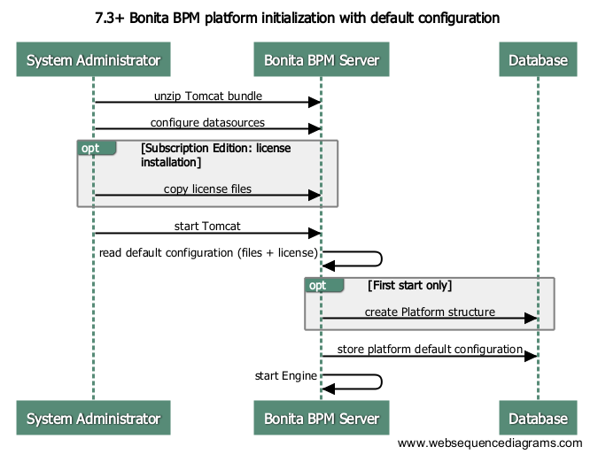
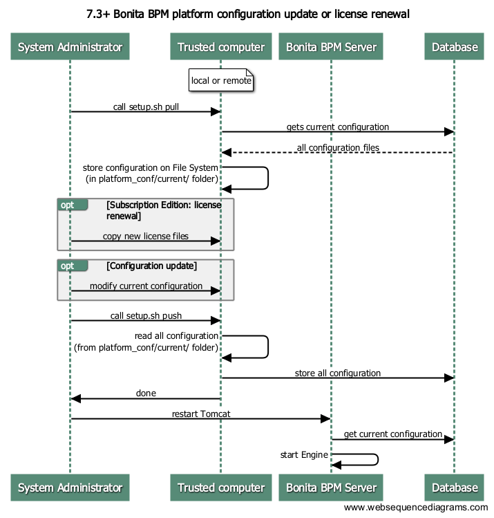

Platform installation and default configuration - Sequence flow
---


Scenario 2 - On premise: how to install a Bonita BPM Tomcat Bundle (subscription)
---


## Download and unzip the Tomcat bundle

### Download

For the Community edition:
* Go to the [Bonitasoft website](http://www.bonitasoft.com/how-we-do-it/downloads) and get the Bonita BPM Community edition Tomcat bundle.

For a Subscription edition:
* Go to the [Customer Portal](https://customer.bonitasoft.com/download/request) and download the Bonita BPM Subscription Pack edition Tomcat bundle.

### Unzip

The fully qualified folder path (including the BonitaBPM-x.y.z-Tomcat-7.0.67 folder) to the folder where you unzip the Tomcat bundle is referred to as `[TOMCAT_BUNDLE_DIR]`. We recommend the following locations: 

* Windows: `C:\BonitaBPM`. If you want to unzip the bundle to another folder, avoid spaces in the folder name. 
* Linux: in `/opt/BonitaBPM`. Make sure that Linux user account used to execute Tomcat is the owner of the folders and files.

**Important note**: Do not leave any blank spaces in the path to the directory containing the Tomcat installation.

## License installation
If you are installing a Subscription edition, you need to [request a license](/licenses.md). 
Copy your Subscription license file into `[TOMCAT_BUNDLE_DIR]`/platform-setup/licenses/

## configuration

* edit file `[TOMCAT_BUNDLE_DIR]`/conf/ **server.xml** and remove the following line to deactivate embedded H2 database:

```
<Listener className="org.bonitasoft.tomcat.H2Listener" tcpPort="9091" baseDir="${org.bonitasoft.h2.database.dir}" start="true" />
```

* edit file `[TOMCAT_BUNDLE_DIR]`/conf/ **bitronix-resources.properties**
    * comment the default embedded H2 database configuration
    * uncomment the configuration for your database vendor (PostgreSQL, Oracle, SQL Server, or MySQL)
    * change the default values for your database configuration to point to an existing database instance and valid credentials
    * Warning: this must be done for 2 different datasources in the file: **resource.ds1.*** and **resource.ds2.***
* drop your database vendor-specific drivers in `[TOMCAT_BUNDLE_DIR]`/lib/bonita
* edit file `[TOMCAT_BUNDLE_DIR]`/conf/Catalina/localhost/ **bonita.xml**
    * comment the default embedded H2 database configuration
    * uncomment the configuration for your database vendor (PostgreSQL, Oracle, SQL Server, or MySQL)
    * change the default values for your database configuration to point to an existing database instance and valid credentials
    * Warning: this must be done for 2 different datasources in the file: **bonitaSequenceManagerDS** and **NotManagedBizDataDS**
* edit file sentenv.sh (Unix system) or setenv.bat (Windows system)
    * change property **DB_OPTS** and change default **h2** value for the one corresponding to your database vendor (Bonita BPM internal database)
    * change property **BDM_DB_OPTS** and change default **h2** value for the one corresponding to your database vendor (Bonita BPM database specific for Business Data feature)

## Edition specification
If you are installing the Performance **Subscription** edition, you need to edit `[TOMCAT_BUNDLE_DIR]/platform-setup/conf/bonita-platform-init-community.properties`
and change the value of the `activeProfiles` key to `'community,performance'`. No change is needed for the Community, Teamwork, or Efficiency edition.


Platform configuration update - Sequence flow
---



